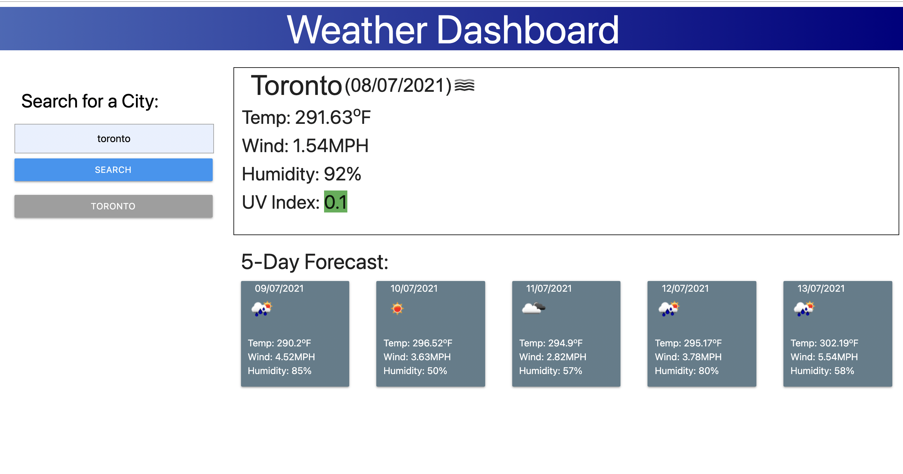

# Weather-To-Go
[click here](https://sonali-pandey.github.io/weather-to-go/) to visit the app.

## Get latest Weather Forecast:

- Search for any city to get:
  - current day forecast
  - next 5-day forecast
 
- Saves up to 10 searches to local storage
- Displays searches on the main page
- Click on the city in search history for quick weather forecast

**CURRENT DAY FORECAST**
  - City Name 
  - Current date
  - Weather icon
  - Temperature
  - Wind Speed
  - Humidity
  - UV Index: Color coded based on severity of the day's conditions

**5-DAY FORECAST**
  - Date
  - Weather icon
  - Temperature
  - Wind Speed
  - Humidity

### API used:
- OpenWeather API [(https://openweathermap.org/)](https://openweathermap.org/)

### Libraries used:
- JQuery [(https://jquery.com/)](https://jquery.com/)
- Day.js [(https://day.js.org/en/)](https://day.js.org/en/)
- Materialize [(https://materializecss.com/)](https://materializecss.com/)

### Screen Shot

 

## Thank you.
### Created by: [Sonali Pandey](github.com/sonali-pandey)

